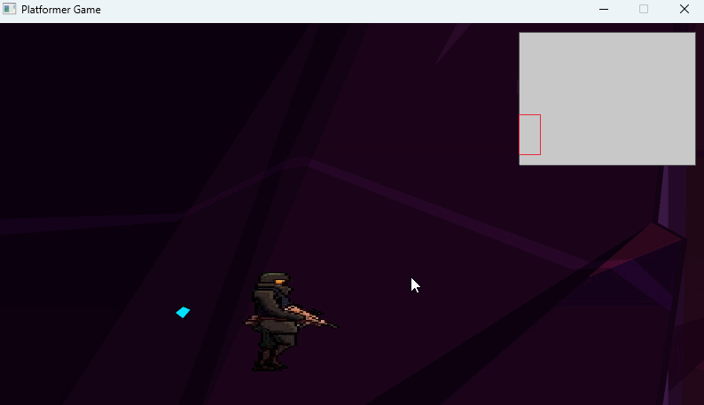

# Zombie Platformer Game



A 2D platformer game developed using Go and Raylib. In this game, the player can perform various actions such as walking, running, jumping, shooting, sitting, and resting. The game includes smooth physics and animations for realistic movement and interactions.

---

## Features

- **Player Movements**: Walking, running, jumping, sitting, and resting with realistic physics.
- **Combat**: Shoot using the left mouse button to defeat obstacles and enemies.
- **Sound Effects**: Includes sound effects for walking, running, and shooting.
- **Animations**: Detailed animations for each player state, including idle, jumping, sitting, resting, and sleeping.
- **State-Based Actions**:
  - **Sitting**: Triggered by holding the control key.
  - **Sitting & Shooting**: Hold control while shooting to fire from a sitting position.
  - **Resting**: Activated after 10 seconds of idle state.
  - **Sleeping**: Entered if in resting state for 15 seconds.

## Controls

| Action             | Key/Button                     |
|--------------------|--------------------------------|
| Walk               | `A` (left) / `D` (right)      |
| Run                | `Shift` + `A` / `D`           |
| Jump               | `Space`                        |
| Shoot              | Left mouse button              |
| Sit                | `Control`                      |
| Sit & Shoot        | `Control` + Left mouse button  |
| Idle               | Automatic when no keys pressed |

## Getting Started

### Prerequisites

- [Go](https://golang.org/dl/) (at least version 1.16)
- [Raylib-Go](https://github.com/gen2brain/raylib-go) bindings installed

### Installation

1. Clone this repository:
   ```bash
   git clone https://github.com/wgalindo1453/platformer-game.git
   cd platformer-game
